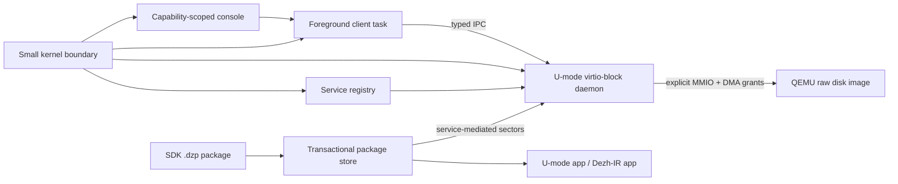

# Dezh OS

[](https://github.com/alisalimi77/Dezh/actions/workflows/ci.yml)

**Repository description:** Intent-native, capability-secure OS research prototype with user-space drivers, typed IPC, transactional package lifecycle, and reboot-safe QEMU demos.

Dezh OS is a bare-metal operating-system research prototype. Its design rule is
deliberately strict:

> No program, app, service, package, driver, or recovery path starts with
> ambient authority. Every effect must be backed by an explicit capability,
> grant, namespace, service route, or transaction.

The current prototype boots on QEMU RISC-V, validates a boot contract, runs
isolated U-mode processes, starts a long-lived user-space `virtio-block`
driver, exercises typed IPC, installs SDK-built `.dzp` packages onto a real
disk image, and validates package update/rollback/recovery across reboot.

This is not a production operating system. It is a working research artifact
intended for technical review.

## Why Dezh Exists

Many systems treat files, processes, packages, services, or users as the main
security boundary. Dezh is exploring a tighter model:

- **Intent-scoped authority:** grant the narrow effect, not broad ambient access.
- **Effect accountability:** important state changes should be inspectable,
  recoverable, and tied to an explicit actor and route.
- **Service-mediated persistence:** storage flows through a user-space service,
  not a hidden kernel block path.
- **No silent lifecycle changes:** package updates, new capabilities, rollback,
  remove, and physical cleanup are explicit.

The long-term thesis is:

**Dezh is an intent-native, effect-accountable OS prototype.**

## What Works Today

- Bare-metal RISC-V boot on QEMU `virt` in S-mode through OpenSBI.
- x86_64 smoke path for the shared Dezh IR runtime.
- Sv39 U-mode process isolation and contained page faults.
- Capability-gated syscalls for print, time, IPC, device, and block access.
- User-space `virtio-block` daemon with explicit MMIO and DMA grants.
- Typed IPC v0 with status codes, request ids, timeouts, and counters.
- Boot-managed service registry with stop, restart, and controlled fault demo.
- Reboot-safe package store for SDK-built `.dzp` apps.
- Transactional package install/remove/update/rollback with journal recovery.
- Package pin/unpin, review, explicit GC, quarantine, and cap-escalation review.
- Embedded demo apps: `note`, `lab`, `calc`, and `vault`.
- No-grant MMIO proof: a task without device grant faults without killing the console.

## System Shape



More diagrams: [docs/ARCHITECTURE_DIAGRAMS.md](docs/ARCHITECTURE_DIAGRAMS.md)

## Quick Review Path

Prerequisites:

- Rust stable
- Python 3.10+
- QEMU:
  - `qemu-system-riscv64`
  - `qemu-system-x86_64`

Install Rust targets:

```sh
rustup target add wasm32-unknown-unknown
rustup target add riscv64gc-unknown-none-elf
rustup target add x86_64-unknown-none
```

Run host tests:

```sh
cargo test --locked --workspace
```

Build the bare-metal kernels:

```sh
cd dezh-boot
cargo build --locked
cd ../dezh-boot-x86
cargo build --locked
cd ..
```

Run the RISC-V smoke test with a real temporary disk image:

```sh
python tools/ci/qemu_smoke.py riscv64 \
  --kernel dezh-boot/target/riscv64gc-unknown-none-elf/debug/dezh-boot \
  --qemu qemu-system-riscv64
```

Run the SDK package lifecycle acceptance test:

```sh
python tools/ci/sdk_test.py \
  --kernel dezh-boot/target/riscv64gc-unknown-none-elf/debug/dezh-boot \
  --qemu qemu-system-riscv64
```

Run the public hygiene scan:

```sh
python tools/review/scan_public.py
```

## Console Commands Worth Reviewing

Inside the RISC-V console:

```text
version
about
status
services
tasks
ipc-typed-demo
ipcstat
install run
apps installed
app-run lab
calc 7 + 5
vault-put demo-secret
vault-get
pkg-list
pkg-store
pkg-review hello
pkg-versions hello
pkg-gc
bench-all
halt
```

The SDK acceptance test covers the deeper package lifecycle:

- install `.dzp`
- reboot and run again
- deny undeclared capability
- transactional remove
- recover interrupted journal states
- quarantine suspicious state
- reject corrupt journal until explicit recovery
- update package
- deny silent cap escalation
- allow cap escalation only with an explicit flag
- rollback to previous checkpoint
- pin/unpin lifecycle changes
- explicit physical cleanup with `pkg-gc run`

## Repository Map

See [docs/REPO_STRUCTURE.md](docs/REPO_STRUCTURE.md) for the full map.

High-level layout:

| Path | Purpose |
| --- | --- |
| `dezh-boot/` | RISC-V bare-metal kernel, console, services, package store, demo apps |
| `dezh-boot/virtio-blk/` | User-space virtio-block daemon ELF |
| `dezh-boot-x86/` | x86_64 smoke target |
| `dezh-core/` | Shared `.dzp`, base64, and Dezh-IR support |
| `dezh-kernel/` | Boot contract and kernel plan validation |
| `dezh-cairn/` | Host-side persistent object/ref prototype |
| `dezh-ir/` | Shared intermediate representation contracts |
| `tools/ci/` | QEMU smoke and SDK lifecycle acceptance |
| `tools/sdk/` | `.dzp` package builder and installer |
| `tools/demo/` | Review/demo transcript runners |
| `tools/review/` | Public review package and hygiene tooling |
| `docs/` | Architecture, security model, roadmap, diagrams, review docs |

## Documentation

- [Architecture](docs/ARCHITECTURE.md)
- [Architecture diagrams](docs/ARCHITECTURE_DIAGRAMS.md)
- [Security model](docs/SECURITY_MODEL.md)
- [Strategic direction](docs/STRATEGIC_DIRECTION.md)
- [SDK guide](docs/SDK_GUIDE.md)
- [Reviewer guide](docs/REVIEWER_GUIDE.md)
- [Demo script](docs/DEMO_SCRIPT.md)
- [Whitepaper](docs/WHITEPAPER.md)
- [Roadmap](docs/ROADMAP.md)
- [Architecture decisions](docs/DECISIONS.md)
- [Repo structure](docs/REPO_STRUCTURE.md)

## Current Limitations

- RISC-V QEMU is the primary bare-metal target today.
- x86_64 currently validates a smaller smoke path.
- The block driver uses QEMU legacy virtio-mmio.
- DMA isolation is modeled through page-table discipline and fixed grants; real
  IOMMU integration is future work.
- Package checksums are deterministic v0 checks, not production signatures.
- App bundles and package limits are intentionally small for reviewability.
- The installer initializes a prototype disk layout; it is not a production boot
  media installer yet.
- Formal verification, side-channel hardening, production networking, graphics,
  and real hardware bring-up are out of scope for the current prototype.

## Project Status

Dezh is ready for architectural review as a research prototype. The most useful
feedback areas are:

- capability and authority model clarity
- whether the user-space driver boundary is in the right place
- typed IPC/service contract shape
- package lifecycle and recovery semantics
- how to turn intent/effect accountability into a stronger OS primitive
- gaps before a serious external review package
