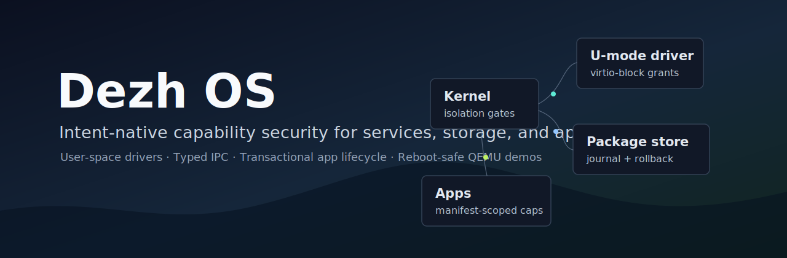
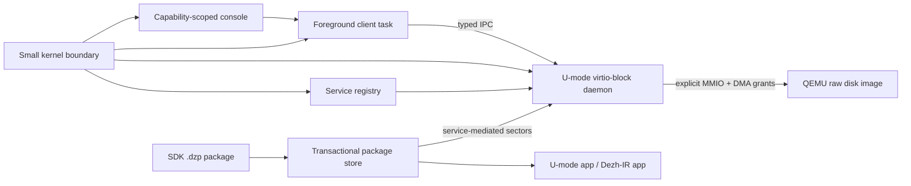

<p align="center">
  
</p>

<p align="center">
  <a href="https://github.com/alisalimi77/Dezh/actions/workflows/ci.yml"></a>
  <a href="LICENSE"></a>
  <a href="https://github.com/alisalimi77/Dezh/releases/tag/v0.2-review"></a>
  <a href="dezh-boot/"></a>
  <a href="dezh-boot-x86/"></a>
  <a href="Cargo.toml"></a>
</p>

<p align="center">
  <strong>Intent-native, capability-secure OS prototype</strong><br>
  User-space drivers · Typed IPC · Rollbackable storage · Transactional apps · Reboot-safe QEMU demos
</p>

<p align="center">
  <a href="#quick-review-path">Quick Review</a> ·
  <a href="#flagship-demos">Flagship Demos</a> ·
  <a href="docs/ARCHITECTURE.md">Architecture</a> ·
  <a href="docs/SECURITY_MODEL.md">Security Model</a> ·
  <a href="docs/RELEASE_PROCESS.md">Release Process</a>
</p>

Dezh OS is a bare-metal operating-system prototype built around one strict
rule:

> No program, app, service, package, driver, or recovery path starts with
> ambient authority. Every effect must be backed by an explicit capability,
> grant, namespace, service route, or transaction.

The current system boots on QEMU RISC-V, validates a boot contract, runs
isolated U-mode processes, starts a long-lived user-space `virtio-block`
driver, exercises typed IPC, installs SDK-built `.dzp` packages onto a real
disk image, and validates package update/rollback/recovery across reboot.

Dezh is not production-ready. It is an executable OS prototype prepared for
architectural and security-model review.

## At A Glance

| Surface | Current evidence |
| --- | --- |
| Boot path | RISC-V QEMU bare-metal boot with validated boot contract |
| Isolation | Sv39 U-mode process isolation with contained page faults |
| Authority | Capability-gated syscalls, IPC, storage namespaces, and device grants |
| Driver model | `virtio-block` runs as a U-mode service with explicit MMIO/DMA grants |
| IPC | Typed request/reply path with status codes, timeouts, and counters |
| Persistence | Cairn v1 commit log with rollbackable refs and per-app namespaces |
| Apps | `.dzp` packages with manifest-scoped caps and transactional lifecycle |
| Review release | [`v0.2-review`](https://github.com/alisalimi77/Dezh/releases/tag/v0.2-review) with a bootable x86_64 ISO, kernels, `.dzp` package, transcript, docs, checksums |

## Review Snapshot

```text
dezh> services
VirtioBlock state=Running task=0 restarts=0

dezh> ipc-typed-demo
[typed-ipc] PASS: OK=OK, BAD_REQUEST=BAD_REQUEST, TIMEOUT=TIMEOUT, DENIED=DENIED

dezh> app-run lab
Dezh Lab :: installable app system probe
[lab-ui] PASS: scheduler, IPC, installer launch, and UI path cooperated

dezh> cairn-demo
[cairn-demo] rollback one step restores the previous commit
[cairn] DENIED: ns=note requires capability CAIRN_NS_0
[cairn-demo] PASS
```

## Why Dezh Exists

Many systems treat files, processes, packages, services, or users as the main
security boundary. Dezh is exploring a tighter model:

- **Intent-scoped authority:** grant the narrow effect, not broad ambient access.
- **Effect accountability:** important state changes should be inspectable,
  recoverable, and tied to an explicit actor and route.
- **Service-mediated persistence:** storage flows through a user-space service,
  not a hidden kernel block path.
- **No silent lifecycle changes:** package updates, new capabilities, rollback,
  remove, and physical cleanup are explicit.

The long-term thesis is:

**Dezh is an intent-native, effect-accountable OS prototype.**

### How Dezh differs

Unlike seL4, Barrelfish, Fuchsia, or Redox — which make **access** safe — Dezh
makes **effect** accountable: every action an agent takes is bound to its
intent, attributable, and reversible where possible. And because the kernel has
no ambient authority by construction, that ledger **cannot be bypassed**.

The real point of comparison is not another OS but user-space agent isolation —
gVisor, Firecracker/microVMs, wasmtime/WASI, seccomp+landlock, containers. They
confine resources well and ship today; what none of them do is attribute every
effect to its authorizing intent and **reverse a whole agent mission** on a
substrate with no ambient authority underneath to route around. ISA (RISC-V,
x86_64) is an implementation backend, not the identity: the same program should
mean the same thing on any backend. See
[strategic direction](docs/STRATEGIC_DIRECTION.md) (D021).

### Terminology

| Term | Meaning |
| --- | --- |
| **Cairn** | The persistent effect layer — a versioned, rollbackable object store. A filesystem is one use of it, not its definition. |
| **Pol** | The Linux compatibility personality: foreign binaries run capability-gated, with zero ambient authority. |
| **Dezh-IR** | The typed, verifiable intermediate format apps and agents execute in — one program, any ISA. |
| **`.dzp`** | The Dezh package format: manifest (requested capabilities) + payload (Dezh-IR or ISA ELF). |
| **Ahd** | An *intent*: a declared capability ceiling and the **only** path to authority. A derived capability is provably ⊆ its Ahd. *(W8)* |
| **Sand** | The *effect ledger* — records `actor → intent → effect` on Cairn. *(W8)* |
| **Sfar** | A *mission*: the set of effects under one Ahd, reversible as a single unit. *(W8)* |
| **Tbar** | The *provenance graph* — a queryable `actor → intent → effect` lineage. *(W8)* |

## What Works Today

- Bare-metal RISC-V boot on QEMU `virt` in S-mode through OpenSBI.
- x86_64 kernel boots from a GRUB Multiboot2 ISO in QEMU **and VirtualBox**,
  with a 32-vector exception IDT (faults reported, not silent triple-faults),
  and runs the byte-identical `.dzp` Dezh-IR package.
- Pol (Linux personality): a real, unmodified static Linux/RISC-V ELF runs
  capability-gated; the same bytes also run on real riscv64 Linux.
- Sv39 U-mode process isolation and contained page faults.
- Capability-gated syscalls for print, time, IPC, device, and block access.
- User-space `virtio-block` daemon with explicit MMIO and DMA grants.
- Typed IPC v0 with status codes, request ids, timeouts, and counters.
- Boot-managed service registry with stop, restart, and controlled fault demo.
- Reboot-safe package store for SDK-built `.dzp` apps.
- Transactional package install/remove/update/rollback with journal recovery.
- Package pin/unpin, review, explicit GC, quarantine, and cap-escalation review.
- Cairn v1: an on-disk commit-log store with per-app namespaces. Every commit
  records its parent ref, object hash, and actor; rollback moves a ref without
  erasing history and survives reboot.
- Kernel-attested capability checks in services: the kernel records the
  sender's capabilities on every IPC message, so the storage service enforces
  namespace access against values a client cannot forge — and denials name the
  missing capability.
- Agent containment: an SDK-built agent app runs with manifest-scoped grants
  (its own namespace only), its bad write is undone by a one-step rollback,
  and a no-capability app is denied by the kernel.
- Embedded demo apps: `note`, `lab`, `calc`, and `vault`.
- No-grant MMIO proof: a task without device grant faults without killing the console.

## Flagship Demos

One reproducible demo per differentiator (see the [roadmap](docs/ROADMAP.md)
for scope and honest wording rules):

| # | Differentiator | Status | Proof |
| --- | --- | --- | --- |
| F1 | Agent containment: narrow grants, kernel denial, attenuated delegation, rollback of an agent's damage | **Reproducible today** (in CI) | [`tools/demo/run_agent_demo.py`](tools/demo/run_agent_demo.py) → [transcript](docs/demo-transcript-agent-f1.md) |
| F2 | Cairn storage: versioned commits, capability-gated namespaces, rollback across reboot | **Reproducible today** (in CI) | `cairn-demo` console flow, exercised by [`tools/ci/qemu_smoke.py`](tools/ci/qemu_smoke.py) incl. a second-boot persistence phase |
| F3 | Multi-ISA apps: the same Dezh-IR program on RISC-V and x86_64 kernels | **Reproducible today** (in CI) | x86_64 kernel installs and runs the byte-identical `.dzp` agent package; bytes pinned by a `dezh-core` test — [x86 smoke](tools/ci/qemu_smoke.py) |
| F4 | Pol compatibility: unmodified static Linux binary, capability-gated | **Reproducible today** (in CI) | `linux-elf` runs a real static Linux/RISC-V ELF ([`linux-guest`](dezh-boot/linux-guest/)); the same bytes also run on real riscv64 Linux |
| W8 | Intent → effect runtime: run an agent under one intent, account for every effect, and undo a whole mission honestly (retract / compensate / refuse-with-reason), with a contained escape | **Reproducible today** (in CI) | `overnight` collapses it into one story → [transcript](docs/demo-transcript-overnight.md); parts: `sfar-demo` `comp-demo` `sfar-cross-demo` `redteam` `why-denied` `tbar` in [`tools/ci/qemu_smoke.py`](tools/ci/qemu_smoke.py) |

**The W8 intent/effect runtime is complete** — intent as the only path to
authority (`Ahd`), the unbypassable effect ledger (`Sand`), honest whole-mission
rollback with compensation and multi-namespace authority (`Sfar`), a five-escape
adversary (`redteam`), and explainable denial + provenance (`why-denied` /
`Tbar`). See the [threat model](docs/THREAT_MODEL.md) for what is and is not
defended.

### For a serious OS reader

Dezh is meant to be scrutinised, not just demoed. The scientific lineage and the
precise, honest novelty claim (what is reused from capabilities, DIFC/provenance,
and sagas — and what is genuinely new) are in
[**Related Work and Novelty**](docs/RELATED_WORK.md); the design paper is the
[**Whitepaper v1**](docs/WHITEPAPER.md). The core authority claim — *a derived
capability can only ever be a subset of its intent, and delegation can only
attenuate* — is not just asserted: it is **machine-checked by exhaustive
enumeration** over the capability space in
[`dezh-kernel::authority`](dezh-kernel/src/lib.rs) (`cargo test -p dezh-kernel`).

## System Shape



More diagrams: [docs/ARCHITECTURE_DIAGRAMS.md](docs/ARCHITECTURE_DIAGRAMS.md)

## Quick Review Path

The shortest useful path is:

```sh
python tools/review/run_full_review.py --quick
```

That command builds the review surface, runs host checks, boots both QEMU
targets, and emits a transcript for the RISC-V demo path.

Prerequisites:

- Rust stable
- Python 3.10+
- QEMU:
  - `qemu-system-riscv64`
  - `qemu-system-x86_64`

Install Rust targets:

```sh
rustup target add wasm32-unknown-unknown
rustup target add riscv64gc-unknown-none-elf
rustup target add x86_64-unknown-none
```

Manual path:

| Step | Command |
| --- | --- |
| Host tests | `cargo test --locked --workspace` |
| RISC-V build | `cd dezh-boot && cargo build --locked` |
| x86_64 build | `cd dezh-boot-x86 && cargo build --locked` |
| Hygiene scan | `python tools/review/scan_public.py` |

RISC-V smoke test with a real temporary disk image:

```sh
python tools/ci/qemu_smoke.py riscv64 \
  --kernel dezh-boot/target/riscv64gc-unknown-none-elf/debug/dezh-boot \
  --qemu qemu-system-riscv64
```

SDK package lifecycle acceptance:

```sh
python tools/ci/sdk_test.py \
  --kernel dezh-boot/target/riscv64gc-unknown-none-elf/debug/dezh-boot \
  --qemu qemu-system-riscv64
```

Release tags build public review artifacts and a GitHub Container Registry
review environment at `ghcr.io/alisalimi77/dezh-review-env:<tag>`. This is a
GitHub Packages/GHCR image, not a Docker Hub image. See
[release process](docs/RELEASE_PROCESS.md) and
[packages and releases](docs/PACKAGES_AND_RELEASES.md).

## Console Commands Worth Reviewing

Inside the RISC-V console:

```text
version
about
status
services
tasks
ipc-typed-demo
ipcstat
install run
apps installed
app-run lab
calc 7 + 5
vault-put demo-secret
vault-get
pkg-list
pkg-store
pkg-review hello
pkg-versions hello
pkg-gc
cairn-demo
cairn-commit note hello
cairn-log note
cairn-rollback note 1
cairn-verify note
agent
bench-all
halt
```

`cairn-demo` walks the full F2 flow: two commits, the log, a bad write, a
one-step rollback, an integrity re-hash, and a cross-namespace request that
the storage service denies based on kernel-attested sender capabilities.

The SDK acceptance test covers the deeper package lifecycle:

- install `.dzp`
- reboot and run again
- deny undeclared capability
- transactional remove
- recover interrupted journal states
- quarantine suspicious state
- reject corrupt journal until explicit recovery
- update package
- deny silent cap escalation
- allow cap escalation only with an explicit flag
- rollback to previous checkpoint
- pin/unpin lifecycle changes
- explicit physical cleanup with `pkg-gc run`

## Measured Claims

Dezh makes no bare "faster than X" claims. What has been measured so far
(method and caveats in [dezh-boot/BENCH.md](dezh-boot/BENCH.md)):

- A Dezh capability check costs **~0.98 ns** (native host build, i7-13650HX).
  The Linux `getpid` syscall floor on the same CPU is **~49 ns** (WSL2 glibc
  wrapper) — mediating an action by capability check is roughly **50× cheaper**
  than mediating it by syscall on this machine. This backs the architecture
  argument; it is a microbenchmark, not a whole-system claim.
- The Dezh kernel `ecall` round-trip measures ~1 µs **under QEMU emulation**,
  which is not comparable to native numbers and is reported only for
  completeness.

## Repository Map

See [docs/REPO_STRUCTURE.md](docs/REPO_STRUCTURE.md) for the full map.

High-level layout:

| Path | Purpose |
| --- | --- |
| `dezh-boot/` | RISC-V bare-metal kernel, console, services, package store, demo apps |
| `dezh-boot/virtio-blk/` | User-space virtio-block daemon ELF |
| `dezh-boot-x86/` | x86_64 smoke target |
| `dezh-core/` | Shared `.dzp`, base64, and Dezh-IR support |
| `dezh-kernel/` | Boot contract and kernel plan validation |
| `dezh-cairn/` | Host-side persistent object/ref prototype |
| `dezh-ir/` | Shared intermediate representation contracts |
| `tools/ci/` | QEMU smoke and SDK lifecycle acceptance |
| `tools/sdk/` | `.dzp` package builder, installer, and app templates (`hello`, `agent`) |
| `tools/demo/` | Review/demo transcript runners (incl. the F1 agent demo) |
| `tools/review/` | Public review package and hygiene tooling |
| `docs/` | Architecture, security model, roadmap, diagrams, review docs |

## Documentation

| Start here | Architecture | Review evidence |
| --- | --- | --- |
| [Documentation index](docs/INDEX.md) | [Architecture](docs/ARCHITECTURE.md) | [Reviewer guide](docs/REVIEWER_GUIDE.md) |
| [Getting started](docs/GETTING_STARTED.md) | [Architecture diagrams](docs/ARCHITECTURE_DIAGRAMS.md) | [Demo script](docs/DEMO_SCRIPT.md) |
| [Build and run](docs/BUILD_AND_RUN.md) | [Security model](docs/SECURITY_MODEL.md) | [Release notes](docs/RELEASE_NOTES.md) |
| [FAQ](docs/FAQ.md) | [Whitepaper](docs/WHITEPAPER.md) | [Release process](docs/RELEASE_PROCESS.md) |
| [Repo structure](docs/REPO_STRUCTURE.md) | [Strategic direction](docs/STRATEGIC_DIRECTION.md) | [Packages and releases](docs/PACKAGES_AND_RELEASES.md) |
| [Changelog](CHANGELOG.md) | [Roadmap](docs/ROADMAP.md) | [Architecture decisions](docs/DECISIONS.md) |

## Governance

| File | Purpose |
| --- | --- |
| [License](LICENSE) | Apache-2.0 licensing |
| [Security policy](SECURITY.md) | Private vulnerability reporting and supported scope |
| [Contributing](CONTRIBUTING.md) | Branch, test, design, and review rules |
| [Code of conduct](CODE_OF_CONDUCT.md) | Expected conduct for public review |

## Current Limitations

- RISC-V QEMU is the primary bare-metal target today.
- The x86_64 kernel boots from an ISO and runs Dezh-IR packages, but is still
  thin: it has an exception IDT but no returnable interrupt path yet (no timer,
  IRQs, or scheduler on x86). The rich interactive surface — console, scheduler,
  IPC, Cairn, Pol — is RISC-V only.
- The block driver uses QEMU legacy virtio-mmio.
- DMA isolation is modeled through page-table discipline and fixed grants; real
  IOMMU integration is future work.
- Package checksums are deterministic v0 checks, not production signatures.
- App bundles and package limits are intentionally small for reviewability.
- The installer initializes a prototype disk layout; it is not a production boot
  media installer yet.
- Formal verification, side-channel hardening, production networking, graphics,
  and real hardware bring-up are out of scope for the current prototype.

## Project Status

Dezh is ready for architectural review as an executable OS prototype. The most
useful feedback areas are:

- capability and authority model clarity
- whether the user-space driver boundary is in the right place
- typed IPC/service contract shape
- package lifecycle and recovery semantics
- how to turn intent/effect accountability into a stronger OS primitive
- gaps before a serious external review package
