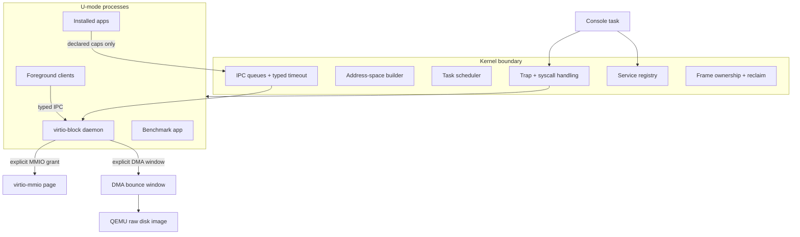
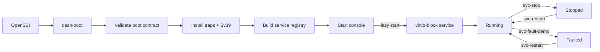
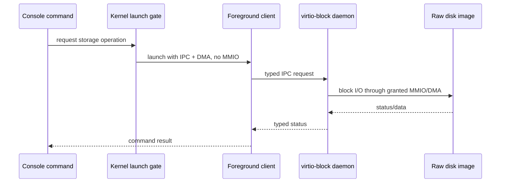
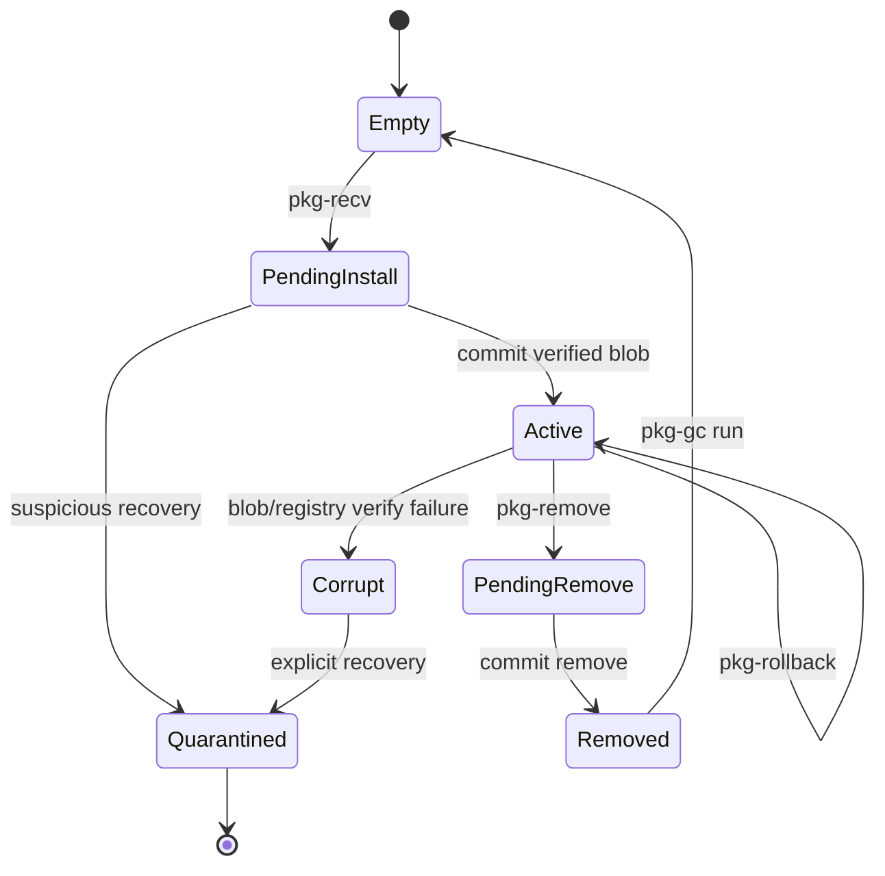
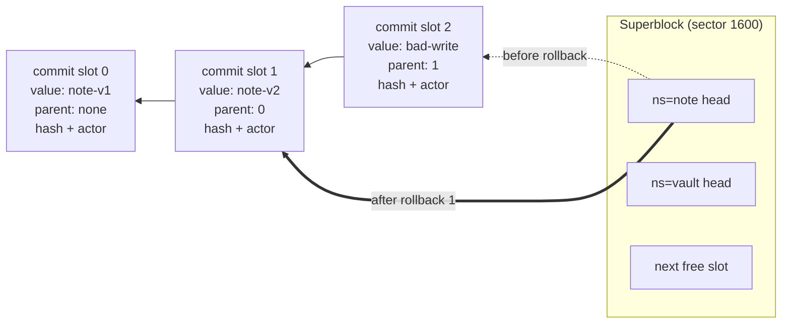
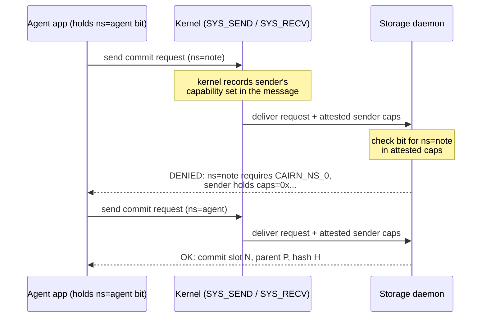
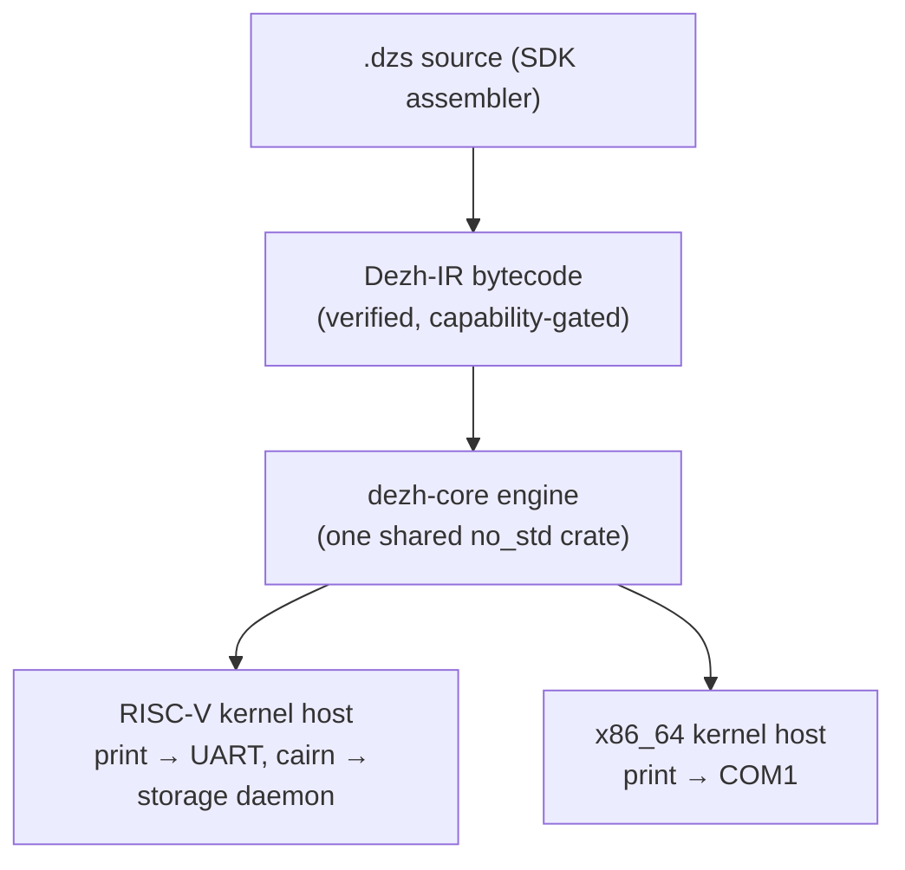
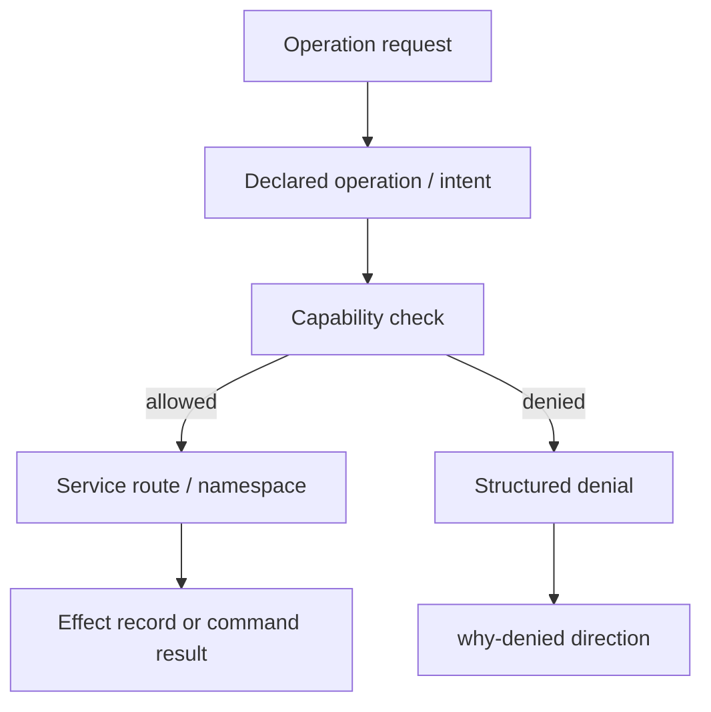

# Architecture

The layers and their authority boundaries, the diagrams that show them, and where
each piece lives in the tree.

---

## Design

<!-- was docs/ARCHITECTURE.md until the 2026-07-23 consolidation -->

Dezh is a bare-metal OS research prototype focused on explicit authority,
service-mediated effects, and recoverable lifecycle operations.

For visual diagrams, see [Diagrams](ARCHITECTURE.md#diagrams).

### Design Center

The current prototype is built around four rules:

1. No ambient authority by default.
2. Device and storage access are service-mediated.
3. Persistent lifecycle changes are transactional and recoverable.
4. Runtime state should be inspectable by reviewers from the console and tests.

The strategic direction is to make **intent** and **effect** first-class OS
concepts. The current implementation is not fully intent-native yet, but the
package, service, IPC, and storage work is deliberately moving toward that
shape.

### Boot Flow

1. OpenSBI starts the RISC-V kernel in S-mode on QEMU `virt`.
2. The kernel validates the boot contract from `dezh-kernel`.
3. The kernel installs trap handling, timer support, and Sv39 paging.
4. A capability-scoped console starts over UART.
5. Services are declared from the boot plan and materialized in the service
   registry.
6. Long-lived services such as `virtio-block` are started explicitly or lazily
   from the registry.

### Kernel Responsibilities

The kernel owns the confinement boundary:

- address-space construction
- trap and syscall handling
- task scheduling
- IPC queues and typed receive timeout support
- service registry state
- explicit process launch grants
- frame ownership and reclaim
- fault containment for U-mode tasks

The kernel does not implement the current block I/O path directly.

### Process Model

Each ELF process receives:

- its own address space
- entry point and initial arguments
- task capabilities
- optional device mappings
- optional DMA mappings
- tracked frame ownership for reclamation

Foreground clients are reclaimed after exit or fault. Daemons remain alive until
they stop, fault, or are explicitly restarted.

### Capability Model

Task capability bits currently cover:

- print
- time
- IPC
- virtio-block device
- block read
- block write
- Cairn namespaces 0..7 (bits 8..15): one bit per named storage namespace

The important property is attenuation: a task can only transfer capabilities it
already holds. Manifest-declared package capabilities are separately translated
into runtime grants; a manifest `cairn-read`/`cairn-write` grant maps to the
app's **own** namespace bit only (matched by app name) — a manifest can never
name another app's namespace.

### IPC

The base IPC syscall sends a small payload, a scalar word, and an attenuated
capability grant. Service paths pack a typed v0 envelope into the scalar word:

```text
proto | service_id | op | request_id | status | arg
```

Storage, installer, app, and package paths use typed replies. Legacy demos can
still use raw scalar messages.

**Kernel-attested sender capabilities:** on every send, the kernel records the
sender's capability set in the message; on receive, the service gets that set
alongside the payload. A service therefore checks the *sender's* authority
against values a client cannot forge from user space. This is how the storage
daemon enforces per-namespace access, and why its denials can name the exact
missing capability (`why-denied` direction from the strategic plan).

### User-Space Block Driver

The `virtio-block` daemon is a separate U-mode ELF. It alone receives:

- the virtio MMIO page grant
- the DMA window grant
- IPC authority
- block read/write authority

Foreground clients do not receive MMIO authority. A no-grant process touching
the MMIO address faults and is killed without killing the console.

The daemon handles:

- disk probe
- block write/read
- root install marker and metadata
- Cairn v0 current/previous value operations (legacy demo path)
- Cairn v1 commit-log store with per-namespace capability checks
- embedded app registry operations
- package registry, journal, and blob sectors
- note/lab/calc/vault private storage
- stop and controlled fault demo

### Cairn v1 (Commit-Log Store)

Cairn v1 lives inside the storage daemon on sectors 1600..1855:

- a superblock holding the namespace table (`note`, `lab`, `calc`, `vault`,
  `agent`) with each namespace's head ref and commit count;
- append-only commit records, each carrying: parent ref, FNV-1a hash of the
  value object, actor task id, a reversibility flag, and the inline value.

Semantics:

- **Commit** appends a record and moves the namespace head ref.
- **Rollback N** walks the parent chain and moves the ref back; history is
  never erased, and the state survives reboot.
- **Verify** re-hashes the head object against its commit record.
- **Access** requires the namespace's capability bit, checked against the
  kernel-attested sender capability set; denials name the missing capability.

The commit record fields (actor, reversibility class, provenance chain) are
the seed of the effect ledger described in
[Strategic direction](ROADMAP.md#strategic-direction) (decision D020).

Dezh-IR apps reach the store through the kernel's IR host, which routes
`cairn_put`/`cairn_get` host calls over typed IPC to the daemon with the app's
own namespace capability — there is no kernel-side block I/O shortcut.

### Service Registry

The service registry tracks:

- service name
- service kind
- state
- task id
- caps
- grants
- restart count
- last exit
- last started tick
- fault reason

Manual stop and controlled fault are not hidden by automatic restart. Review
commands use explicit `svc-restart` so service recovery remains visible and
deterministic.

### Package Store

The SDK builds `.dzp` packages. The OS stores them through the user-space block
service, not through a kernel block path.

Current package features:

- persistent registry on disk
- transaction journal
- active, previous, and stage blob areas
- install/remove/update/rollback
- recovery and quarantine
- pin/unpin
- cap-escalation review
- explicit physical cleanup through `pkg-gc run`

Only `Active` packages are runnable. `Removed`, `Corrupt`, `Pending*`, and
`Quarantined` packages do not run.

### Embedded Apps

The current embedded app set is intentionally mixed:

- `note`: persistent text app
- `lab`: UI-like multi-task app with cooperating workers
- `calc`: calculator app with stored last result
- `vault`: private-value app used to exercise storage and device-denial paths

These are review demos, not a production app ecosystem.

### Storage Path

The storage path is:

```text
console command -> foreground client -> typed IPC -> virtio-block daemon
               -> granted MMIO/DMA -> disk image
```

This path is central to the project. It proves that storage does not silently
fall back to a kernel block driver.

### Review Surface

Useful review commands:

- `services`
- `tasks`
- `ipcstat`
- `ipc-typed-demo`
- `pkg-store`
- `pkg-journal`
- `pkg-review <name>`
- `pkg-versions <name>`
- `pkg-gc`
- `cairn-demo` / `cairn-log <ns>` / `cairn-rollback <ns> [n]` / `cairn-verify <ns>`
- `agent`
- `bench-all`

Useful review tools:

- `tools/ci/qemu_smoke.py`
- `tools/ci/sdk_test.py`
- `tools/review/scan_public.py`
- `tools/demo/run_review_demo.py`
- `tools/demo/run_agent_demo.py` (F1 agent-containment transcript)

---

## Diagrams

<!-- was docs/ARCHITECTURE_DIAGRAMS.md until the 2026-07-23 consolidation -->

These diagrams are part of the review surface. They show the current prototype,
not a production promise.

### System Overview



### Boot And Service Graph



### Storage Authority Path



Important property: clients do not receive device MMIO authority. The daemon is
the only process with the virtio MMIO page grant.

### Package Lifecycle



Lifecycle rules:

- Only `Active` packages are runnable.
- New capabilities during update require explicit `--allow-new-caps`.
- Pins block update and rollback until explicit review.
- GC never touches `Active`, `Corrupt`, or `Quarantined` slots.

### Disk Layout

```mermaid
flowchart LR
    S0["sector 0\ninstall marker"] --> S2["sector 2\nCairn v0 current"]
    S2 --> S3["sector 3\nCairn v0 previous"]
    S3 --> S4["sector 4\nroot metadata"]
    S4 --> S5["sectors 5..7\napp registry v0"]
    S5 --> S24["sector 24\npackage marker"]
    S24 --> S25["sectors 25..31\npackage registry"]
    S25 --> S32["sectors 32..39\npackage journal"]
    S32 --> S64["sectors 64..575\nactive package blobs"]
    S64 --> P["sectors 576..1087\nprevious blobs"]
    P --> ST["sectors 1088..1599\nstage blobs"]
    ST --> C1["sector 1600\nCairn v1 superblock"]
    C1 --> C2["sectors 1601..1855\nCairn v1 commit log"]
```



The package store is intentionally small and inspectable in v0:

- 8 package slots
- 32 KiB per slot
- active, previous, and stage blob areas
- journaled recovery before package execution

### Cairn v1 Commit Log

Each namespace is a ref into an append-only chain of commit records. Rollback
moves the ref; nothing is erased.



Commit record fields — parent ref, object hash (FNV-1a), actor task id, and a
reversibility flag — are the on-disk seed of the effect ledger direction in
[Strategic direction](ROADMAP.md#strategic-direction) (D020).

### Namespace Capability Attestation (F1/F2 core mechanic)

The storage daemon never trusts what a client *says*; it checks what the
kernel *attests* the sender holds.



### Multi-ISA Execution (F3 direction)

The same Dezh-IR bytecode runs on every Dezh kernel; only the thin host
bindings differ per ISA.



### Authority And Denial



The current implementation has capability-gated operations and audit events.
The strategic direction is to make intent and effect records first-class OS
objects.

---

## Repository layout

<!-- was docs/REPO_STRUCTURE.md until the 2026-07-23 consolidation -->

This repository mixes a bare-metal OS prototype, host-side research crates, SDK
tooling, QEMU test harnesses, and public review documentation. This file is the
map for reviewers.

### Bare-Metal Targets

| Path | Role |
| --- | --- |
| `dezh-boot/` | Main RISC-V QEMU `virt` boot target. Contains kernel entry, console, task model, service registry, package store, package lifecycle, embedded apps, and user-space process launch. |
| `dezh-boot/virtio-blk/` | User-space `virtio-block` daemon. It receives explicit MMIO and DMA grants and performs the prototype disk I/O path. |
| `dezh-boot/userprog/` | Small user program used by legacy demos and process-launch smoke paths. |
| `dezh-boot/bench-app/` | U-mode benchmark app used by `bench-all`. |
| `dezh-boot/note-app/` | Embedded note demo app. |
| `dezh-boot/lab-app/` | Embedded multi-task lab demo app. |
| `dezh-boot/calc-app/` | Embedded calculator demo app. |
| `dezh-boot/vault-app/` | Embedded private-value demo app. |
| `dezh-boot-x86/` | Smaller x86_64 boot/smoke target for multi-ISA validation. |

### Shared Crates

| Path | Role |
| --- | --- |
| `dezh-core/` | Shared `.dzp`, base64, and Dezh-IR support used by the boot target and SDK-adjacent code. |
| `dezh-kernel/` | Boot contract, kernel plan, install manifest, and plan validation logic. |
| `dezh-ir/` | Dezh IR contract crate. |
| `dezh-cairn/` | Host-side persistent object/ref prototype. |
| `dezh-host/` | Host capability model experiments and tests. |
| `dezh-ipc/` | Host-side IPC/capability experiments. |
| `dezh-identity/` | Delegation and invocation-chain experiments. |
| `dezh-runtime/` | Host-side runtime boundary experiments. |
| `dezh-linux/` | Compatibility and authority experiments for Linux-like paths. |
| `dezh-scheduler/` | Scheduling-policy experiments. |

### Tools

| Path | Role |
| --- | --- |
| `tools/ci/qemu_smoke.py` | Boots RISC-V or x86_64 QEMU targets and asserts expected console behavior. |
| `tools/ci/sdk_test.py` | End-to-end SDK/package lifecycle acceptance test across multiple QEMU reboots. |
| `tools/sdk/build_pkg.py` | Builds `.dzp` packages from app directories. |
| `tools/sdk/install_pkg.py` | Boots Dezh in QEMU and streams packages through the console upload protocol. |
| `tools/sdk/dzas.py` | Tiny Dezh-IR assembler for SDK apps. |
| `tools/demo/run_review_demo.py` | Runs the review demo and captures a transcript. |
| `tools/demo/run_agent_demo.py` | Runs an agent-containment demo transcript. |
| `tools/review/scan_public.py` | Public hygiene scan for review-package readiness. |
| `tools/review/make_review_package.py` | Builds a clean review package snapshot. |

### Documentation

| Path | Role |
| --- | --- |
| `README.md` | Public landing page and quick review path. |
| `docs/ARCHITECTURE.md` | Architecture explanation. |
| `docs/ARCHITECTURE.md#diagrams` | Mermaid diagrams for the current prototype. |
| `docs/SECURITY_MODEL.md#enforcement-model` | Threat model and enforced/not-yet-enforced boundaries. |
| `docs/ROADMAP.md#strategic-direction` | Intent-native/effect-accountable direction and open review questions. |
| `docs/SDK_GUIDE.md` | How to build, install, update, and run `.dzp` packages. |
| `docs/REVIEWER_GUIDE.md` | Short path for external technical review. |
| `docs/ROADMAP.md` | Roadmap and current milestone direction. |
| `docs/DECISIONS.md` | Architecture decision notes. |
| `docs/REVIEWER_GUIDE.md#running-the-demos` | Manual demo script. |
| `docs/WHITEPAPER.md` | Technical whitepaper draft. |
| `docs/OUTREACH.md` | Draft outreach templates. |

### Generated/Local Artifacts

These should not be committed:

- `target/`
- `dist/`
- `graphify-out/`
- raw QEMU disk images (`*.img`)
- Python bytecode caches

The repository intentionally keeps reproducible tools and transcripts, but not
local generated build output.
