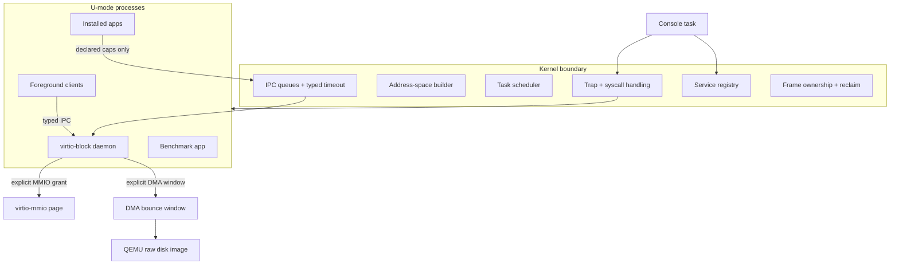
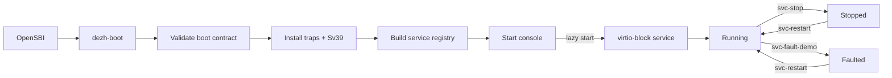
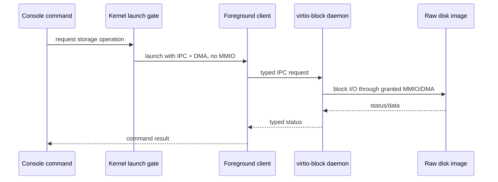
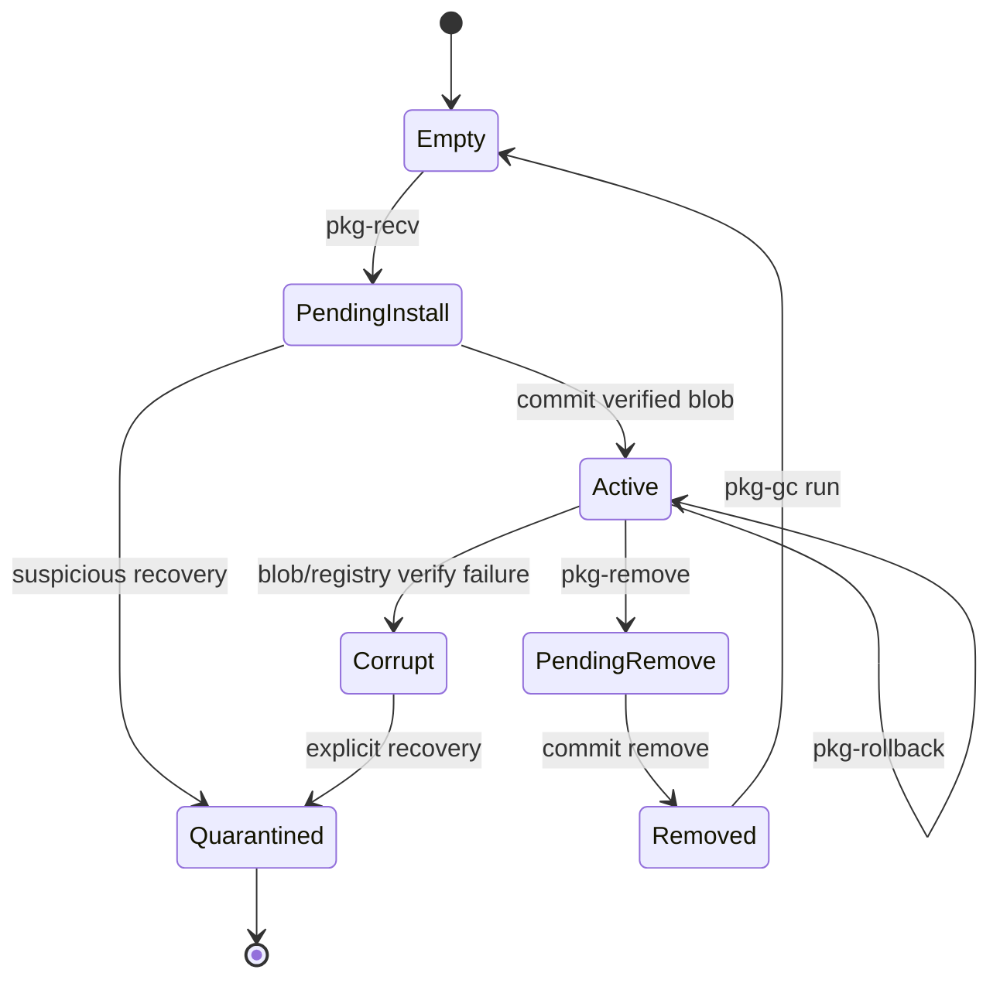
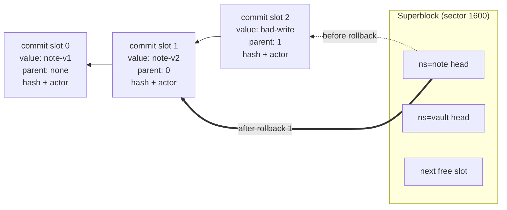
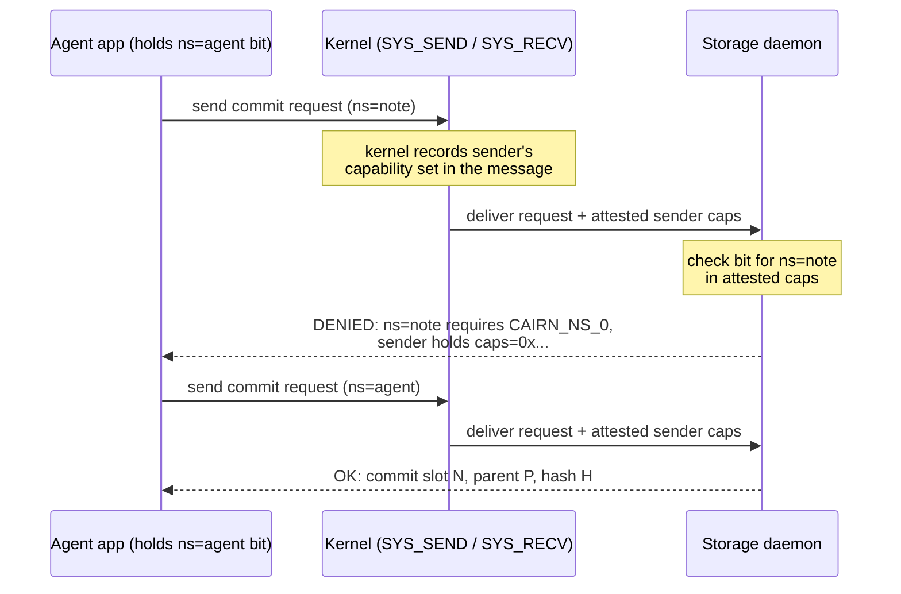
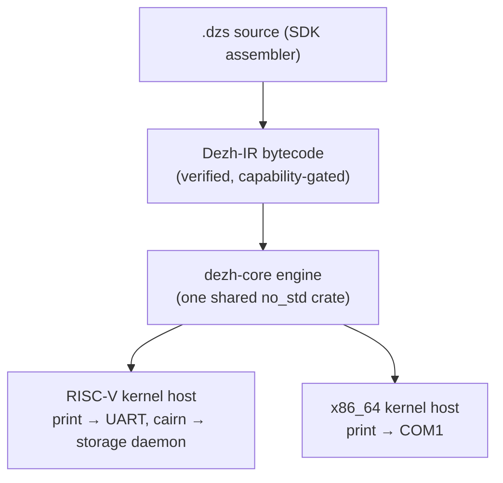
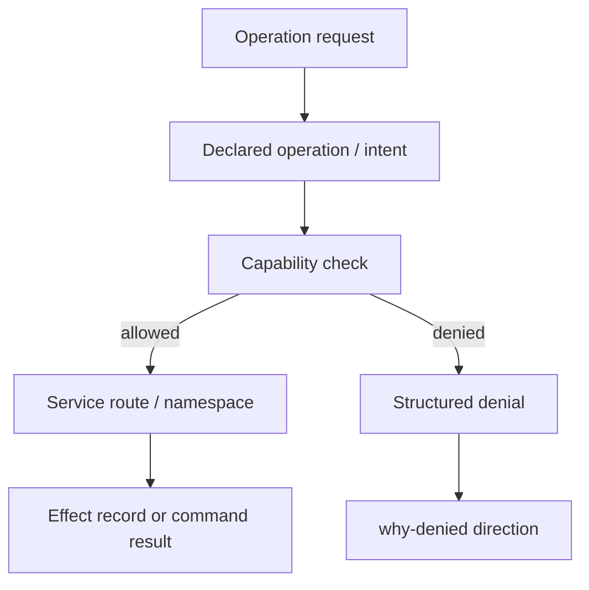

# Dezh Architecture Diagrams

These diagrams are part of the review surface. They show the current prototype,
not a production promise.

## System Overview

## Boot And Service Graph

## Storage Authority Path

Important property: clients do not receive device MMIO authority. The daemon is
the only process with the virtio MMIO page grant.

## Package Lifecycle

Lifecycle rules:

- Only `Active` packages are runnable.
- New capabilities during update require explicit `--allow-new-caps`.
- Pins block update and rollback until explicit review.
- GC never touches `Active`, `Corrupt`, or `Quarantined` slots.

## Disk Layout

```mermaid
flowchart LR
    S0["sector 0\ninstall marker"] --> S2["sector 2\nCairn v0 current"]
    S2 --> S3["sector 3\nCairn v0 previous"]
    S3 --> S4["sector 4\nroot metadata"]
    S4 --> S5["sectors 5..7\napp registry v0"]
    S5 --> S24["sector 24\npackage marker"]
    S24 --> S25["sectors 25..31\npackage registry"]
    S25 --> S32["sectors 32..39\npackage journal"]
    S32 --> S64["sectors 64..575\nactive package blobs"]
    S64 --> P["sectors 576..1087\nprevious blobs"]
    P --> ST["sectors 1088..1599\nstage blobs"]
    ST --> C1["sector 1600\nCairn v1 superblock"]
    C1 --> C2["sectors 1601..1855\nCairn v1 commit log"]
```

The package store is intentionally small and inspectable in v0:

- 8 package slots
- 32 KiB per slot
- active, previous, and stage blob areas
- journaled recovery before package execution

## Cairn v1 Commit Log

Each namespace is a ref into an append-only chain of commit records. Rollback
moves the ref; nothing is erased.

Commit record fields — parent ref, object hash (FNV-1a), actor task id, and a
reversibility flag — are the on-disk seed of the effect ledger direction in
[STRATEGIC_DIRECTION.md](STRATEGIC_DIRECTION.md) (D020).

## Namespace Capability Attestation (F1/F2 core mechanic)

The storage daemon never trusts what a client *says*; it checks what the
kernel *attests* the sender holds.

## Multi-ISA Execution (F3 direction)

The same Dezh-IR bytecode runs on every Dezh kernel; only the thin host
bindings differ per ISA.

## Authority And Denial

The current implementation has capability-gated operations and audit events.
The strategic direction is to make intent and effect records first-class OS
objects.
