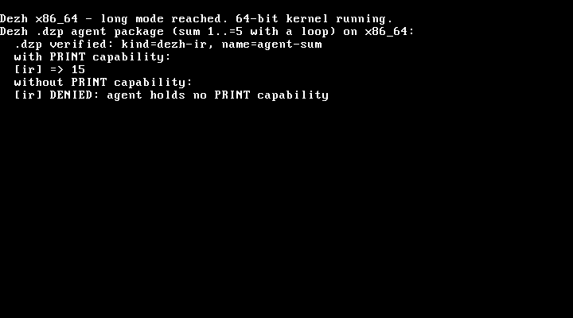

# Getting started

From a clone to a running kernel: what Dezh is, the shortest path to a boot, the
full build matrix, and running it outside QEMU.

To judge the claims rather than run them, start at
[REVIEWER_GUIDE.md](REVIEWER_GUIDE.md).

---

## Overview

<!-- was docs/OVERVIEW.md until the 2026-07-23 consolidation -->

Dezh OS is a capability-secure operating-system research prototype. It tests a
microkernel-shaped design where programs, apps, services, and drivers receive no
default authority. Authority is granted explicitly through capabilities,
address-space mappings, IPC permissions, device grants, and DMA windows.

### Why This Exists

Modern systems still carry many broad authority paths: inherited process
authority, global filesystem assumptions, kernel-resident drivers, and service
interfaces that blur ownership. Dezh explores a stricter baseline:

```text
No authority exists unless the boot plan, service registry, or caller grants it.
```

This rule is enforced in the current prototype at several layers:

- syscall capability checks
- U-mode page-table isolation
- explicit device and DMA mappings
- capability-gated IPC
- service-mediated storage
- app registry validation

### Current Demonstration

The RISC-V QEMU build demonstrates:

- boot contract validation
- capability-scoped console
- isolated U-mode ELF processes
- user-space virtio-block daemon
- typed IPC status and timeout behavior
- install/root marker on a real disk image
- app install, run, remove, and deny flows
- service stop, restart, and controlled fault recovery
- benchmark and denial suites

The x86_64 build demonstrates the shared Dezh IR path on a second ISA.

### What Makes The Prototype Interesting

- **No ambient authority:** there is no default device, filesystem, block, IPC,
  or time access for tasks.
- **Drivers outside the kernel:** the block device is serviced by a U-mode
  daemon that alone receives the MMIO and DMA grants.
- **Typed service contracts:** important storage and installer paths return
  structured statuses instead of raw ad hoc values.
- **Service supervision:** the console survives service stop and controlled
  service fault, then restarts the driver explicitly.
- **Install path discipline:** app install and app private storage go through
  the registered service path.
- **Reviewable evidence:** the smoke test and review demo exercise the path end
  to end under QEMU.

### Prototype Boundaries

Dezh is not production-ready. The current work is a research artifact with a
small kernel, embedded app bundles, a v0 registry format, and QEMU-centered
device support. The point of the current repository state is to make the
architecture concrete enough for serious review.

---

## Quickstart

<!-- was docs/GETTING_STARTED.md until the 2026-07-23 consolidation -->

This guide is the shortest path to validating Dezh locally.

### Prerequisites

Install:

- Rust stable
- Python 3.10 or newer
- QEMU:
  - `qemu-system-riscv64`
  - `qemu-system-x86_64`

Install Rust targets:

```sh
rustup target add wasm32-unknown-unknown
rustup target add riscv64gc-unknown-none-elf
rustup target add x86_64-unknown-none
```

### Clone And Test

```sh
git clone https://github.com/alisalimi77/Dezh.git
cd Dezh
cargo test --locked --workspace
```

### Build The Bare-Metal Kernels

```sh
cd dezh-boot
cargo build --locked
cd ../dezh-boot-x86
cargo build --locked
cd ..
```

### Run The RISC-V Smoke Test

```sh
python tools/ci/qemu_smoke.py riscv64 \
  --kernel dezh-boot/target/riscv64gc-unknown-none-elf/debug/dezh-boot \
  --qemu qemu-system-riscv64
```

This boots the RISC-V kernel in QEMU with a real temporary disk image and
checks the console, service registry, typed IPC, storage path, package path,
denial proofs, and benchmark command.

### Run The SDK Package Acceptance Test

```sh
python tools/ci/sdk_test.py \
  --kernel dezh-boot/target/riscv64gc-unknown-none-elf/debug/dezh-boot \
  --qemu qemu-system-riscv64
```

This validates that a `.dzp` package can be built, installed, run, denied,
removed, recovered, updated, rolled back, pinned, unpinned, and garbage
collected through the service-mediated package store.

### Run The Public Hygiene Scan

```sh
python tools/review/scan_public.py
```

The scan checks public-facing files for private paths, secret-like tokens, and
non-neutral identity/geography markers.

### One-Command Review Runner

For a consolidated pass:

```sh
python tools/review/run_full_review.py --quick --qemu-riscv qemu-system-riscv64 --qemu-x86 qemu-system-x86_64
```

Use `--full` to include the longer SDK package lifecycle acceptance test.

---

## Build and run

<!-- was docs/BUILD_AND_RUN.md until the 2026-07-23 consolidation -->

This document describes repeatable local validation for Dezh OS.

### Toolchain

Required:

- Rust stable
- Python 3.10 or newer
- QEMU RISC-V and x86_64 system emulators

Rust targets:

```sh
rustup target add wasm32-unknown-unknown
rustup target add riscv64gc-unknown-none-elf
rustup target add x86_64-unknown-none
```

### Windows PowerShell

If QEMU is installed in the default Windows path:

```powershell
$QemuRiscv = "C:/Program Files/qemu/qemu-system-riscv64.exe"
$QemuX86 = "C:/Program Files/qemu/qemu-system-x86_64.exe"
```

Build:

```powershell
cargo test --locked --workspace
Push-Location dezh-boot
cargo build --locked
Pop-Location
Push-Location dezh-boot-x86
cargo build --locked
Pop-Location
```

RISC-V smoke:

```powershell
python tools\ci\qemu_smoke.py riscv64 `
  --kernel dezh-boot\target\riscv64gc-unknown-none-elf\debug\dezh-boot `
  --qemu $QemuRiscv
```

Interactive RISC-V boot with a local disk image:

```powershell
fsutil file createnew dezh-local.img 2097152
& $QemuRiscv `
  -machine virt `
  -nographic `
  -bios default `
  -kernel dezh-boot\target\riscv64gc-unknown-none-elf\debug\dezh-boot `
  -drive file=dezh-local.img,format=raw,if=none,id=dezhdisk `
  -device virtio-blk-device,drive=dezhdisk
```

At the prompt, try:

```text
help
status
services
ipc-typed-demo
install run
pkg-store
bench-all
halt
```

### Linux

Install QEMU using the distribution package manager. On Debian or Ubuntu:

```sh
sudo apt-get update
sudo apt-get install -y qemu-system-misc qemu-system-x86
```

Build:

```sh
cargo test --locked --workspace
(cd dezh-boot && cargo build --locked)
(cd dezh-boot-x86 && cargo build --locked)
```

Run:

```sh
python tools/ci/qemu_smoke.py riscv64 \
  --kernel dezh-boot/target/riscv64gc-unknown-none-elf/debug/dezh-boot \
  --qemu qemu-system-riscv64
```

### macOS

Install QEMU with Homebrew:

```sh
brew install qemu
```

Build and smoke commands are the same as Linux.

### Review Validation

Run the consolidated quick review:

```sh
python tools/review/run_full_review.py --quick
```

Run the longer review path:

```sh
python tools/review/run_full_review.py --full
```

The full path runs public hygiene checks, host tests, RISC-V and x86_64 builds,
RISC-V QEMU smoke, review demo transcript generation, and SDK package lifecycle
acceptance.

### Troubleshooting

If QEMU is not found, pass the full path using `--qemu`, `--qemu-riscv`, or
`--qemu-x86`, depending on the script.

If the RISC-V console appears but the Enter key does not work in a terminal,
use the scripted smoke runner. The console accepts carriage return and newline,
but some terminal pipelines buffer input differently.

If package commands fail with `virtio-block unavailable`, confirm that QEMU was
started with:

```text
-drive file=...,format=raw,if=none,id=dezhdisk
-device virtio-blk-device,drive=dezhdisk
```

---

## Running in a VM

<!-- was docs/QUICKSTART_VM.md until the 2026-07-23 consolidation -->

Two ways to see Dezh boot, one per architecture. Neither needs the source tree —
just a released artifact and a VM. Both show the same thesis in action: a program
(here, an agent package) can only do what it was granted.

### x86_64 in VirtualBox or VMware (bootable ISO)

This is the "install it like a real OS" path.

1. Download `dezh-<tag>-x86_64.iso` from the release.
2. Create a new VM: type **Other / Unknown (64-bit)**, **128 MB** RAM, **no hard disk**.
3. Attach the ISO as the VM's optical (CD/DVD) drive.
4. Start the VM.

The kernel boots through GRUB into 64-bit long mode and runs a real `.dzp` agent
package on screen: it verifies the package (`kind=dezh-ir, name=agent-sum`), runs
the capability-gated agent (prints `15`), then runs it again **without** the print
capability and the kernel **denies** it. Output goes to the VGA screen (shown
below) and to COM1 serial.



The boot also installs a 32-vector exception IDT and, at the end, deliberately
raises a breakpoint to prove faults are **caught and reported** (not a silent
triple-fault reset). A returnable interrupt path (timer / device IRQs) is still
future work — see [ROADMAP.md](ROADMAP.md).

### x86_64 in QEMU (same ISO)

```sh
qemu-system-x86_64 -cdrom dezh-<tag>-x86_64.iso -serial stdio
```

### RISC-V in QEMU (one-liner)

The RISC-V kernel is an interactive capability console — the richest demo surface
(agent containment, Cairn rollback, the Linux personality, benchmarks).

```sh
# optional: a disk enables reboot-persistent Cairn state
qemu-img create -f raw dezh-disk.img 4M

qemu-system-riscv64 -machine virt -nographic -bios default \
  -kernel dezh-<tag>-riscv64-qemu-kernel.elf \
  -drive file=dezh-disk.img,format=raw,if=none,id=hd0 \
  -device virtio-blk-device,drive=hd0
```

At the `dezh>` prompt, try:

| Command | Shows |
| --- | --- |
| `caps` | the console's own capabilities |
| `linux-elf` | a real unmodified Linux/RISC-V ELF run under the Pol personality (F4) |
| `cairn-demo` | versioned storage: commit, roll back, cross-namespace denial (F2) |
| `agent` | a `.dzp` agent: works in-grant, denied beyond it (F1/F3) |
| `bench-pol` | measured Pol syscall-translation overhead (F4/D015) |
| `help` | the full command list |

Exit with `halt`.
