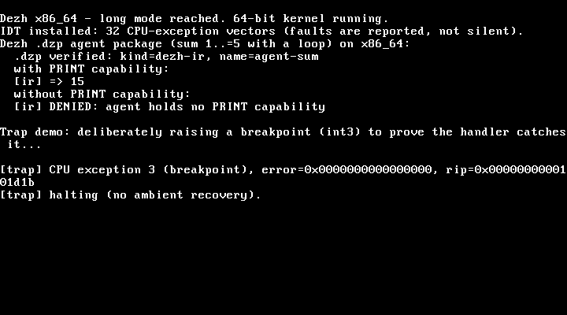

# Quickstart: run Dezh in a VM

Two ways to see Dezh boot, one per architecture. Neither needs the source tree —
just a released artifact and a VM. Both show the same thesis in action: a program
(here, an agent package) can only do what it was granted.

## x86_64 in VirtualBox or VMware (bootable ISO)

This is the "install it like a real OS" path.

1. Download `dezh-<tag>-x86_64.iso` from the release.
2. Create a new VM: type **Other / Unknown (64-bit)**, **128 MB** RAM, **no hard disk**.
3. Attach the ISO as the VM's optical (CD/DVD) drive.
4. Start the VM.

The kernel boots through GRUB into 64-bit long mode and runs a real `.dzp` agent
package on screen: it verifies the package (`kind=dezh-ir, name=agent-sum`), runs
the capability-gated agent (prints `15`), then runs it again **without** the print
capability and the kernel **denies** it. Output goes to the VGA screen (shown
below) and to COM1 serial.



The boot also installs a 32-vector exception IDT and, at the end, deliberately
raises a breakpoint to prove faults are **caught and reported** (not a silent
triple-fault reset). A returnable interrupt path (timer / device IRQs) is still
future work — see [ROADMAP.md](ROADMAP.md).

## x86_64 in QEMU (same ISO)

```sh
qemu-system-x86_64 -cdrom dezh-<tag>-x86_64.iso -serial stdio
```

## RISC-V in QEMU (one-liner)

The RISC-V kernel is an interactive capability console — the richest demo surface
(agent containment, Cairn rollback, the Linux personality, benchmarks).

```sh
# optional: a disk enables reboot-persistent Cairn state
qemu-img create -f raw dezh-disk.img 4M

qemu-system-riscv64 -machine virt -nographic -bios default \
  -kernel dezh-<tag>-riscv64-qemu-kernel.elf \
  -drive file=dezh-disk.img,format=raw,if=none,id=hd0 \
  -device virtio-blk-device,drive=hd0
```

At the `dezh>` prompt, try:

| Command | Shows |
| --- | --- |
| `caps` | the console's own capabilities |
| `linux-elf` | a real unmodified Linux/RISC-V ELF run under the Pol personality (F4) |
| `cairn-demo` | versioned storage: commit, roll back, cross-namespace denial (F2) |
| `agent` | a `.dzp` agent: works in-grant, denied beyond it (F1/F3) |
| `bench-pol` | measured Pol syscall-translation overhead (F4/D015) |
| `help` | the full command list |

Exit with `halt`.
